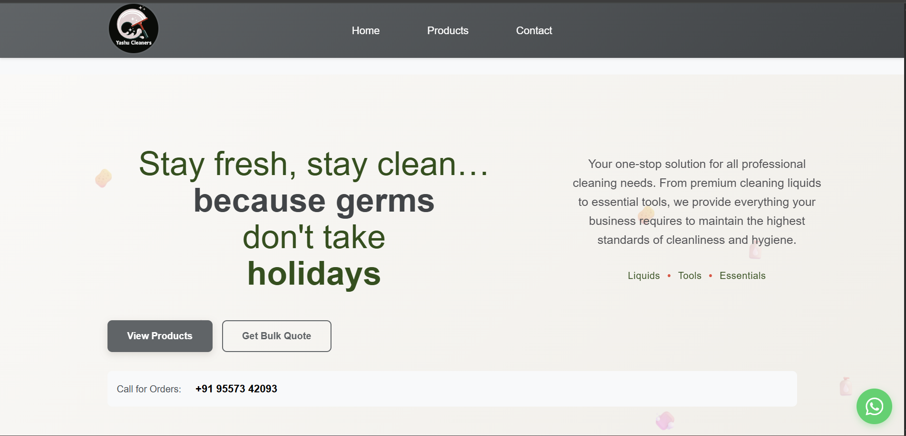
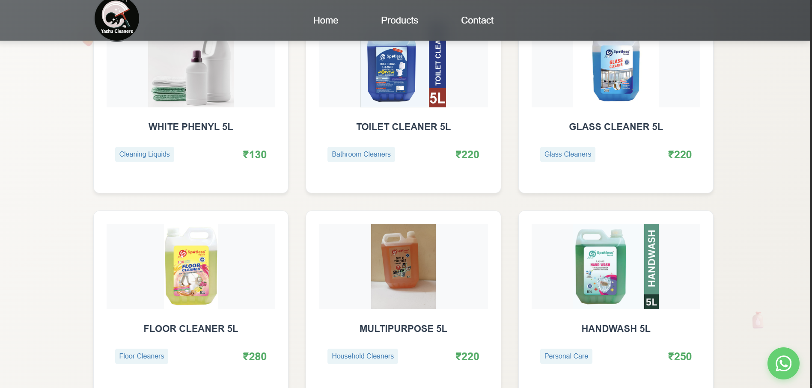

# Yashu Cleaners

Modern, responsive React + Vite website for Yashu Cleaners — premium cleaning solutions for home and business.

## Screenshots





## Features

- Clean, responsive UI with reusable components
- Product catalog with category filters and search
- Contact page with EmailJS-powered form
- Fast local dev and production builds via Vite

## Tech Stack

- React 18, React DOM
- Vite 5 (dev server and bundler)
- Vanilla CSS (global + component styles)

## Project Structure (simplified)

```
.
├─ public/
│  ├─ favicon.ico
│  └─ images/
│     ├─ logo/
│     ├─ products/
│     └─ review/
├─ src/
│  ├─ components/
│  │  ├─ common/ (Header, Footer, Navigation)
│  │  ├─ contact/ (ContactForm, ContactInfo)
│  │  ├─ home/ (HeroSection, FeaturedProducts, Testimonials, WhyChooseUs)
│  │  ├─ products/ (Grid, Card, Filter, CategorySection)
│  │  └─ ui/ (Hero, Button, Card, Modal, WhatsAppChat)
│  ├─ config/ (emailjs.js)
│  ├─ data/ (products.js)
│  ├─ pages/ (Home.jsx, Home_new.jsx, Products.jsx, About.jsx, Contact.jsx)
│  ├─ styles/ (globals.css, components.css)
│  ├─ App.jsx
│  └─ main.jsx
├─ index.html
├─ package.json
├─ vite.config.js
└─ README.md
```

## Getting Started

Prerequisites:
- Node.js 18+ (required by Vite 5)
- npm 8+

Install dependencies:

```powershell
npm install
```

Start the dev server:

```powershell
npm run dev
```

Build for production:

```powershell
npm run build
```

Preview the production build locally:

```powershell
npm run preview
```

Optional linting:

```powershell
npm run lint
npm run lint:fix
```

## Configuration (Contact Form / EmailJS)

The contact form uses EmailJS. Configure your credentials in `src/config/emailjs.js`:

1. Create an account at https://www.emailjs.com/
2. Create a Service and a Template
3. Copy your Public Key, Service ID, and Template ID
4. Update:
   - `serviceId: 'YOUR_SERVICE_ID'`
   - `templateId: 'YOUR_TEMPLATE_ID'`
   - `publicKey: 'YOUR_PUBLIC_KEY'`

Note: The sample file includes placeholders. Do not commit real secrets.

## Development Tips

- Products data lives in `src/data/products.js`
- Global styles in `src/styles/globals.css`; component styles in `src/styles/components.css`
- Header navigation links are in `src/components/common/Header.jsx`

## Deployment

1. Build: `npm run build`
2. Host the `dist/` folder on any static host (Netlify, Vercel static export, GitHub Pages, or your own server)

## Browser Support

Latest versions of Chrome, Edge, Firefox, and Safari (desktop and mobile).

## License

MIT

## Contact

- Email: yashucleaners@gmail.com
- Phone: +91 95573 42093

© 2025 Yashu Cleaners. All rights reserved.
